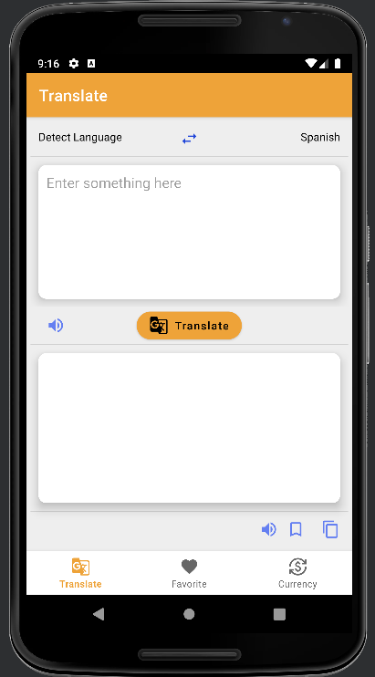
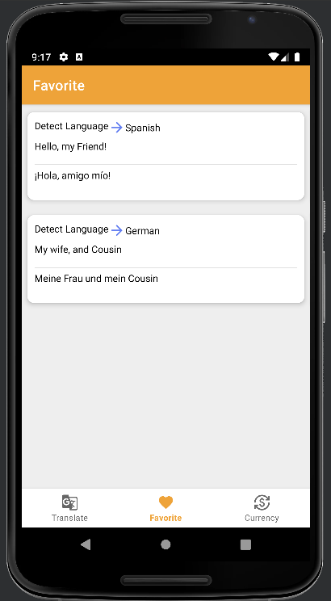
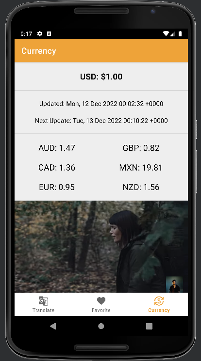
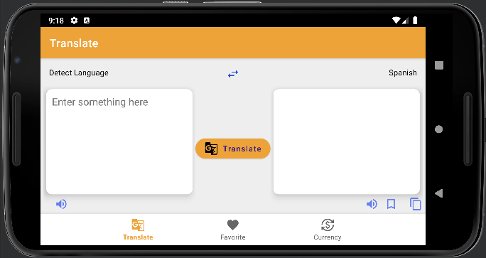
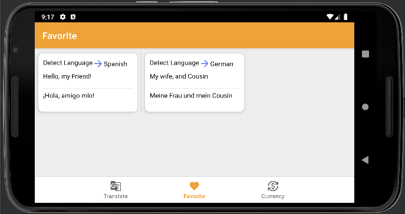
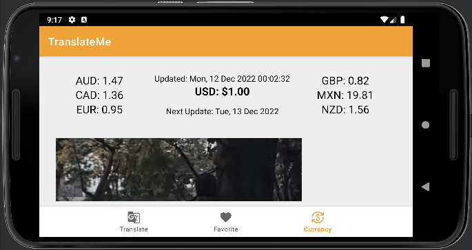

# TranslateMe App - Final Project and Presentation

## The Translator and Currency-Exchange App

The "TranslateMe" App is an App used for translating languages as well as knowing the current state of currency (dollars) value in other Countries. Using translation apps is an efficient way to eliminate language barriers and ensure communication between people who speak different languages.

 How Do Translation Apps Work? 

 

An automatic translation software system interprets the structure of sentences in the source language (the language the user is translating from) and generates a translation based on the rules of the target language (the language the user is translating to).

 How To Use App? 

 

With Tap to Translate, you can translate text from apps and you don't need to open the Google Translate app.

1) Open an app with text you can copy.
2) Highlight the text you want to translate. Copy.
3) On your current screen, tap Google Translate .
4) Choose the language you want.

---

## CLASS

Professor Mike Peralta

CPSC-411-01

Fridays 4:00pm - 6:45pm

---

## Group Information

### TEAM WORDLE

- Terrell D Lemons [886659440](LemonsTerrell@csu.fullerton.edu)

- Tommy Vu

- Vong

- Zhiqiang Liu

## IMAGES OF PROJECT (Portrait)

<table>
  <tr>
    <td>Translate Language</td>
     <td>Favorites Saved</td>
     <td>Currency Exchange</td>
  </tr>
  <tr>
    <td></td>
    <td></td>
    <td></td>
  </tr>
 </table>

## IMAGES OF PROJECT (Landscape)
  
<table>
  <tr>
    <td>Translate Language</td>
     <td>Favorites Saved</td>
     <td>Currency Exchange</td>
  </tr>
  <tr>
    <td></td>
    <td></td>
    <td></td>
  </tr>
 </table>

---

 REQUIREMENTS 

 

### Fresh Clone

Student(s) performed a fresh clone of their project before
presenting.

---

### Callbacks

User action executes a callback somewhere

---

### Logging

User action or business logic causes emission to Logcat.

---

### Layouts

Use of ConstraintLayout and one other container/layout type.

---

### Resources – Two Images

At least two image resources found in app

---

### Resources - Interactivity

Two resources change in some way due to user interaction.

---

### Resources (extra credit)

Embedded a playable video or audio resource, somewhere.

---

### Resource Qualifiers - Translations

App is translated to multiple languages.

---

### Resource Qualifiers - Layouts

App has multiple layouts that get used via qualifiers.

---

### Resource Qualifiers - Wildcard

App has a third type of resource that gets selected via
qualifiers (not translations or layouts).

---

### Persistence – Rotation Survival (ViewModel)

App has data that survives rotation via a ViewModel.

---

### Persistence – App Exit Survival

App has data that survives a complete app exit.

---

### Persistence – Database

App allows user to enter data that can be saved to a local
SQLite database, and fetched later. Data survives app exit.
User is able to save/fetch multiple entries for the same type
of data (i.e., multiple rows in a database table).

- This requirement may be tweaked slightly the week before
presentations, if needed.

---

### Persistence – Preferences w/ DataStore or Firestore

App let’s user set and get preferences using the DataStore
package. Preferences survive app exit.

- Alternatively, Firestore may be used.

---

### UI Flexibility – Fragments Present

App has multiple fragments, each with their own controllers
and layouts.

---

### UI Flexibility – Fragments in Layout

App has at least one layout that contains multiple fragments
at the same time.

### UI Flexibility – Fragment Reuse

Fragments in app are reused in multiple layouts.

---

### RESTful GET

App is able to fetch data from a remote REST endpoint using
the Jetpack library, via a GET request.

---

### RESTful POST

App is able to send data to a remote REST endpoint using the
Jetpack library, via a POST request. Data sent to server
comes from user input.

- Student confirmed the sent data can be fetched after an app
exit. (i.e., sent data survives app restart)

<iframe width="100%" height="800" src="./2022-Fall - CPSC 411A - Final Project and Presentation - Grading Template.pdf">

